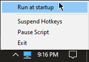

# AHK for Windows

A simple and intuitive AutoHotKey script for enhancing windows shortcuts, dedicated to improving users’ workflow.

> ## AutoHotKey
>
> AutoHotkey is a free and open-source custom scripting language for Microsoft Windows, initially aimed at providing easy keyboard shortcuts or hotkeys, fast macro-creation, and software automation that allows users of most levels of computer skill to automate repetitive tasks in any Windows application.
>
> - Homepage: [autohotkey.com](https://www.autohotkey.com "Go to autohotkey homepage")
> - Downloading page: [/download](https://www.autohotkey.com/download "Go to autohotkey download page")
> - Direct download: [/ahk-install.exe](https://www.autohotkey.com/download/ahk-install.exe "Directly download autohotkey")

```text
+------------------------------------------+
| CAUTION!                                 |
| These scripts tend to be very addictive. |
+------------------------------------------+
```

## Usages

### Option 1

[ *Recommended* ]

1. Download the `WINDOWS_AHK.exe` from one of the [releases](https://github.com/arlbibek/windows-ahk/releases "Visit releases page").
2. Run the `WINDOWS_AHK.exe` file.
3. Done! _You shall now see the `WINDOWS_AHK.exe` file running on the system tray._

### Option 2

[ _If you have trust issues with .exe(s) and/or want to make some changes_ ]

1. First, Download and Install AutoHotKey [ *from one of the links above* ].
2. Then, Download the `WINDOWS.ahk` file from one of the [releases](https://github.com/arlbibek/windows-ahk/releases "Visit releases page") (or you may clone the repo).
3. Run the `WINDOWS.ahk` file.
4. Done! _You shall now see the `WINDOWS.ahk` file running on the system tray._

> To automatically run the script when you log on to the computer, simply, click on the `Run at startup` option in the script's tray menu.
>
> 

---

## Keyboard Shortcuts

| #   | Notes                                                                                                                                                                                                                                                                                                                                                                            |
| --- | -------------------------------------------------------------------------------------------------------------------------------------------------------------------------------------------------------------------------------------------------------------------------------------------------------------------------------------------------------------------------------- |
| -   | **It is important to note that all the pre-existing hotkeys/shortcuts will be overridden.**                                                                                                                                                                                                                                                                                      |
| -   | The tilde `~` at the beginning of certain key (eg. <kbd>~CapsLock</kbd>) means holding down the key.                                                                                                                                                                                                                                                                             |
| -   | For those hotkeys that throw an error saying `Error. Failed attempt to launch program or document:` ... `Specifically: The system cannot find the file specified.`, please consider adding the respective program (folder) to the [path of your system variables](https://www.architectryan.com/2018/03/17/add-to-the-path-on-windows-10/ "See: Add to the PATH on Windows 10"). |
| -   | Anything with this (🤵) emoji is a custom/specific shortcut that might not work or suit your needs.                                                                                                                                                                                                                                                                              |

### Hotkey

aka **shortcut keys** - easily trigger an action (such as launching a program or keyboard macro)
[[ahk](https://www.autohotkey.com/docs/Hotkeys.htm "See hotkey documentation")].

#### Global

| Key                                                            | Action                                                                                                                                                        |
| -------------------------------------------------------------- | ------------------------------------------------------------------------------------------------------------------------------------------------------------- |
| <kbd>F1</kbd>                                                  | Open/Switch/Cycle through Firefox                                                                                                                             |
| <kbd>Shift</kbd> + <kbd>F1</kbd>                               | Open Firefox (new window)                                                                                                                                     |
| <kbd>F3</kbd>                                                  | Open/Switch/Minimize Spotify                                                                                                                                  |
| <kbd>F4</kbd>                                                  | Open/Switch/Cycle through VS Code                                                                                                                             |
| <kbd>F6</kbd>                                                  | Open/Switch to/Minimize SumatraPDF                                                                                                                            |
| <kbd>F7</kbd>                                                  | Open/Switch to/Minimize Microsoft Word                                                                                                                        |
| <kbd>F8</kbd>                                                  | Open/Switch to/Minimize Microsoft Excel                                                                                                                       |
| <kbd>Win</kbd> + <kbd>E</kbd>                                  | Open/Switch/Cycle through File Explorer                                                                                                                       |
| <kbd>Shift</kbd> + <kbd>Win</kbd> + <kbd>E</kbd>               | Open File Explorer (new window)                                                                                                                               |
| <kbd>Win</kbd> + <kbd>N</kbd>                                  | Open/Switch/Cycle through Notepad (_<kbd>Esc</kbd> will close notepad without saving contents_)                                                               |
| <kbd>Shift</kbd> + <kbd>Win</kbd> + <kbd>N</kbd>               | Open Notepad (new window)                                                                                                                                     |
| <kbd>Win</kbd> + <kbd>S</kbd>                                  | Search selected text via active browser (or the default browser) 🔍                                                                                           |
| <kbd>Ctrl</kbd> + <kbd>Alt</kbd> + <kbd>P</kbd>                | Toggle presentation mode on or off                                                                                                                            |
| <kbd>~CapsLock</kbd> & <kbd>7</kbd>                            | Transform selected text to lower case (eg. `Hello, Word!` to `hello, word!`)                                                                                  |
| <kbd>~CapsLock</kbd> & <kbd>8</kbd>                            | Transform selected text to titled case (eg. `hello, word!` to `Hello, Word!`)                                                                                 |
| <kbd>~CapsLock</kbd> & <kbd>9</kbd>                            | Transform selected text to upper case (eg. `Hello, Word!` to `HELLO, WORD!`)                                                                                  |
| <kbd>~Ctrl</kbd> & <kbd title="Left Mouse Button">LMouse</kbd> | Drag a window by click any point inside the window (rather than just the title bar) [[ref](https://www.autohotkey.com/docs/scripts/index.htm#EasyWindowDrag)] |

#### File Explorer & Terminal Groups

> This works for all the explorer-based "save" and "load" boxes
> and Terminal Groups (i.e. `WindowsTerminal` `PowerShell` `Command Prompt` `Debian (wsl)` `Kali (wsl)` `Ubuntu (wsl)`)

| Key                                                | Action                                                                                                                                    |
| -------------------------------------------------- | ----------------------------------------------------------------------------------------------------------------------------------------- |
| <kbd>Win</kbd> + <kbd>E</kbd>                      | Run/Switch/Cycle through all the active File Explorers                                                                                    |
| <kbd>Ctrl</kbd> + <kbd>Shift</kbd> + <kbd>U</kbd>  | Navigate to Current user directory 👤                                                                                                     |
| <kbd>Ctrl</kbd> + <kbd>Shift</kbd> + <kbd>E</kbd>  | Navigate to This Pc 💻                                                                                                                    |
| <kbd>Ctrl</kbd> + <kbd>Shift</kbd> + <kbd>H</kbd>  | Navigate to the Desktop (H for Home 😅)                                                                                                   |
| <kbd>Ctrl</kbd> + <kbd>Shift</kbd> + <kbd>D</kbd>  | Navigate to the Documents directory 📄                                                                                                    |
| <kbd>Ctrl</kbd> + <kbd>Shift</kbd> + <kbd>J</kbd>  | Navigate to the Downloads directory 📥                                                                                                    |
| <kbd>Ctrl</kbd> + <kbd>Shift</kbd> + <kbd>M</kbd>  | Navigate to the Music directory 🎵                                                                                                        |
| <kbd>Ctrl</kbd> + <kbd>Shift</kbd> + <kbd>P</kbd>  | Navigate to the Pictures directory 🖼                                                                                                      |
| <kbd>Ctrl</kbd> + <kbd>Shift</kbd> + <kbd>V</kbd>  | Navigate to the Videos directory 📼                                                                                                       |
| <kbd>Ctrl</kbd> + <kbd>Shift</kbd> + <kbd>C</kbd>  | Navigate to `C:\` 💾                                                                                                                      |
| <kbd>Ctrl</kbd> + <kbd>Shift</kbd> + <kbd>A</kbd>  | 🤵 Navigate to arlbibek directory                                                                                                         |
| <kbd>Ctrl</kbd> + <kbd>Shift</kbd> + <kbd>S</kbd>  | 🤵 Navigate to Screenshot directory                                                                                                       |
| <kbd>Ctrl</kbd> + <kbd>Shift</kbd> + <kbd>T</kbd>  | Open Windows Terminal in Current Working Directory                                                                                        |
| <kbd>Ctrl</kbd> + <kbd>Shift</kbd> + <kbd>\\</kbd> | Open VS Code in Current Working Directory (_uses context menu_); <br/> _And if a file/folder is selected this will create it's shortcut;_ |

### Google Docs/Sheets

Note that the following commands will (only) work within google docs or the sheets window regardless of the browser.

and it is highly recommended that you disable the google sheets autocomplete feature. [ `Menu >> Tools >> Autocomplete` *Uncheck the* `Enable autocomplete` *option* ]

| Key                                              | Action                                          |
| ------------------------------------------------ | ----------------------------------------------- |
| <kbd>Ctrl</kbd> + <kbd>Insert</kbd>              | Opens comment box                               |
| <kbd>Ctrl</kbd> + <kbd>8</kbd>                   | Strike selected text(s)/shell(s)                |
| <kbd>Alt</kbd> + <kbd>1</kbd>                    | Highlight selected text(s)/shell(s) (yellow)    |
| <kbd>Alt</kbd> + <kbd>Shift</kbd> + <kbd>1</kbd> | Remove Highlight from selected text(s)/shell(s) |
| <kbd>Alt</kbd> + <kbd>2</kbd>                    | Wrap selected shell(s) _(\*Google Sheets only)_ |
| <kbd>Ctrl</kbd> + <kbd>3</kbd>                   | Trim whitespace _(\*Google Sheets only)_        |
| <kbd>Ctrl</kbd> + <kbd>4</kbd>                   | Spell check                                     |
| <kbd>Ctrl</kbd> + <kbd>Delete</kbd>              | Move the current sheet/doc to Trash             |

### Hotstring

**What is a hotstring?**

Hotstrings are mainly used to expand abbreviations as you type them (auto-replace), they can also be used to launch any scripted action [[ahk]](https://www.autohotkey.com/docs/Hotstrings.htm "See hotstring documentation").

```ahk
; For example:
::wtf::Wow that's fantastic
```

#### Date and time

Assuming today's date and time is `Sunday, October 10, 2021, 02:55 PM`

| Abbreviation  | Phrase                            |
| ------------- | --------------------------------- |
| `/datetime`   | Sunday, October 10, 2021, 14:55   |
| `/datetimett` | Sunday, October 10, 2021 02:55 PM |
| `/time`       | 14:55                             |
| `/timett`     | 02:55 PM                          |
| `/date`       | October 10, 2021                  |
| `/daten`      | 10/10/2021                        |
| `/week`       | Sunday                            |
| `/day`        | 10                                |
| `/month`      | October                           |
| `/monthn`     | 10                                |
| `/year`       | 2021                              |

#### Others

| Abbreviation | Phrase                                                                            |
| ------------ | --------------------------------------------------------------------------------- |
| `/paste`     | _Paste contents of clip board_                                                    |
| `/cud`       | _Full path of current user directory_ (eg. `/mnt/c/Users/bibek/`)                 |
| `/nrd`       | npm run dev                                                                       |
| `/gm`        | Good morning                                                                      |
| `/ge`        | Good evening                                                                      |
| `/gn`        | Good night                                                                        |
| `/ty`        | Thank you                                                                         |
| `/tyvm`      | Thank you very much                                                               |
| `/wc`        | Welcome                                                                           |
| `/mp`        | My pleasure!                                                                      |
| `/lorem`     | Lorem ipsum dolor sit amet, consectetur adipiscing elit, sed do eiusmod..         |
| `/plankton`  | Plankton are the diverse collection of organisms found in water that are unable.. |

### Some other useful resources (scripts)

- [AutoHotkey Script Showcase](https://www.autohotkey.com/docs/scripts/index.htm "This showcase lists some scripts created by different authors which show what AutoHotkey might be capable of.") by autohotkey.
- [Skrommel's One Hour Software](https://www.dcmembers.com/skrommel/downloads/)

---

Made with ❤️ by [Bibek Aryal](https://bibeka.com.np/).
