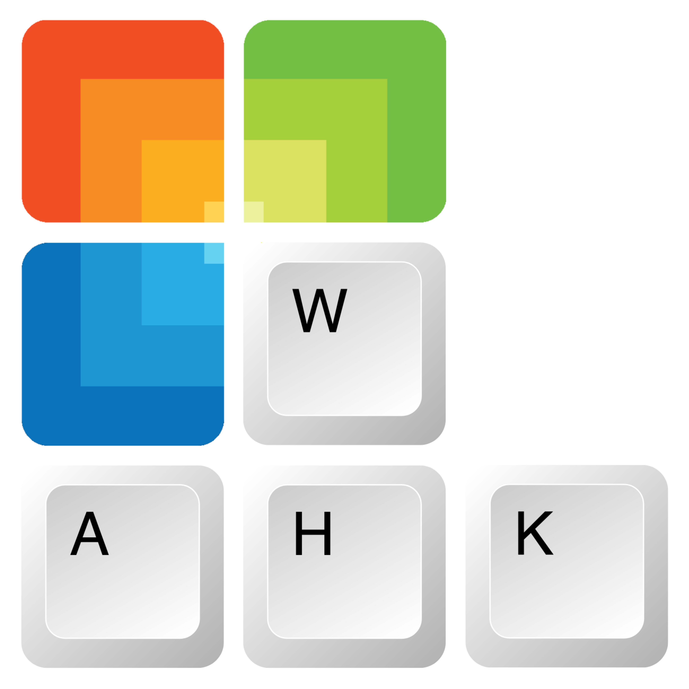

# AHK for Windows

A simple and intuitive AutoHotKey script for enhancing windows shortcuts, dedicated to improving users’ workflow.



## Features

Here are some of the list of features

- Quickly open and switch between apps
- Effortless navigation in the file explorer
- Quick text search (via selection)
- Toggle presentation mode
- Quickly transform text case (e.g. `hello, word!` to `Hello, Word!`)
- Easy hotstrings to get current datetime (e.g. _enter `/date` to get current date eg. July 13, 2022_) and more

## About AutoHotKey

AutoHotkey is a free and open-source custom scripting language for Microsoft Windows, initially aimed at providing easy keyboard shortcuts or hotkeys, fast macro-creation, and software automation that allows users of most levels of computer skill to automate repetitive tasks in any Windows application.

- Homepage: [autohotkey.com](https://www.autohotkey.com "Go to autohotkey homepage")
- Downloading page: [/download](https://www.autohotkey.com/download "Go to autohotkey download page")
- Direct download: [/ahk-install.exe](https://www.autohotkey.com/download/ahk-install.exe "Directly download autohotkey")

```text
+------------------------------------------+
| CAUTION!                                 |
| These scripts tend to be very addictive. |
+------------------------------------------+
```

## Usages

### Option 1

[ _Recommended_ ]

1. Download the `WINDOWS_AHK.exe` from one of the [/releases](https://github.com/arlbibek/windows-ahk/releases).
2. Run the `WINDOWS_AHK.exe` file.

### Option 2

[ _If you have trust issues with .exe(s) and/or want to make some changes_ ]

1. First, download and install AutoHotKey from [autohotkey.com/download](https://www.autohotkey.com/download)
2. Then, download the `WINDOWS.ahk` file from one of the [/releases](https://github.com/arlbibek/windows-ahk/releases) (or you may clone the repo).
3. Run the `WINDOWS.ahk` file.

See [keyboard shortcuts](#keyboard-shortcuts).

---

<details>
  <summary><i>Click to see details on tray menu options</i></summary>

## Tray menu options

| Option                       | Action                                                                                            | Key                                                                 |
| ---------------------------- | ------------------------------------------------------------------------------------------------- | ------------------------------------------------------------------- |
| Run at startup               | Enable/disable script to run automatically as startup (when you log on to you computer)           |                                                                     |
| Presentation Mode            | Toggle windows default presentation mode on/off                                                   | <kbd>Win</kbd> + <kbd>Shift</kbd> + <kbd>P</kbd>                    |
| Keyboard shortcut            | View keyboard shortcuts, opens a pdf file containing the keyboard shortcuts and respective action | <kbd>Ctrl</kbd> + <kbd>Shift</kbd> + <kbd>Alt</kbd> + <kbd>\\</kbd> |
| Open file location           | Navigate to script's current directory                                                            |                                                                     |
| View in GitHub               | View source code in GitHub                                                                        |                                                                     |
| See AutoHotKey documentation | Visit official AutoHotKey documentation via web                                                   |                                                                     |
| Suspend Hotkeys              | Disables or enables all hotkeys and hotstrings                                                    | <kbd>Ctrl</kbd> + <kbd>Shift</kbd> + <kbd>Alt</kbd> + <kbd>S</kbd>  |

---

</details>

## Keyboard Shortcuts

> **Notes**
>
> - **Use <kbd>Ctrl</kbd> + <kbd>Shift</kbd> + <kbd>Alt</kbd> + <kbd>S</kbd> to quickly [suspend hotkeys](https://www.autohotkey.com/docs/v1/lib/Suspend.htm "Disable (or enable) all hotkeys and hotstrings.").** Note that any conflicting hotkeys will be overridden.
> - The tilde (`~`) before a key (e.g. <kbd>~Esc</kbd>) indicates holding down the key.
> - If a hotkey throws an error "`Error. Failed attempt to launch program or document,`..." ensure the program/folder is added to the [system variable path](https://www.architectryan.com/2018/03/17/add-to-the-path-on-windows-10/ "See: Add to the PATH on Windows 10").
> - Emoji (`🤵`) indicates a custom shortcut that may not be compatible or suitable for all users.

### Hotkey

aka **shortcut keys** - easily trigger an action (such as launching a program or keyboard macro) [[ahk]](https://www.autohotkey.com/docs/Hotkeys.htm "See hotkey documentation").

#### Global

| Key                                                               | Action                                                                                                                                                                                                 |
| ----------------------------------------------------------------- | ------------------------------------------------------------------------------------------------------------------------------------------------------------------------------------------------------ |
| <kbd>F1</kbd>                                                     | Open/Switch/Cycle through default browser (eg. [Firefox](https://www.mozilla.org/en-US/firefox/new/))                                                                                                  |
| <kbd>Shift</kbd> + <kbd>F1</kbd>                                  | Open default browser (new window)                                                                                                                                                                      |
| <kbd>F3</kbd>                                                     | Open/Switch/Minimize [Spotify](https://www.spotify.com/)                                                                                                                                               |
| <kbd>F4</kbd>                                                     | Open/Switch/Cycle through [VS Code](https://code.visualstudio.com/)                                                                                                                                    |
| <kbd>F6</kbd>                                                     | Open/Switch/Minimize [SumatraPDF](https://www.sumatrapdfreader.org/)                                                                                                                                   |
| <kbd>F7</kbd>                                                     | Open/Switch/Minimize Microsoft Word                                                                                                                                                                    |
| <kbd>F8</kbd>                                                     | Open/Switch/Minimize Microsoft Excel                                                                                                                                                                   |
| <kbd>F10</kbd>                                                    | Open/Switch/Minimize [WindowsTerminal](https://aka.ms/terminal)                                                                                                                                        |
| <kbd>Shift</kbd> + <kbd>F10</kbd>                                 | Open WindowsTerminal (new window)                                                                                                                                                                      |
| <kbd>Ctrl</kbd> + <kbd>Shift</kbd> + <kbd>\`</kbd>                | Open/Switch/Minimize [Synctrayzor (Syncthing)](https://syncthing.net/)                                                                                                                                 |
| <kbd>Win</kbd> + <kbd>E</kbd>                                     | Open/Switch/Cycle through File Explorer                                                                                                                                                                |
| <kbd>Win</kbd> + <kbd>Shift</kbd> + <kbd>E</kbd>                  | Open File Explorer (new window)                                                                                                                                                                        |
| <kbd>Win</kbd> + <kbd>N</kbd>                                     | Open/Switch/Cycle through [Notepad](https://apps.microsoft.com/store/detail/windows-notepad/9MSMLRH6LZF3)                                                                                              |
| <kbd>Win</kbd> + <kbd>Shift</kbd> + <kbd>N</kbd>                  | Open Notepad (new window)                                                                                                                                                                              |
| <kbd>Win</kbd> + <kbd>S</kbd>                                     | Search selected text via active browser (or the default browser)                                                                                                                                       |
| <kbd>Win</kbd> + <kbd>Shift</kbd> + <kbd>S</kbd>                  | Search contents of clipboard via active browser (or the default browser)                                                                                                                               |
| <kbd>Win</kbd> + <kbd>C</kbd>                                     | Center current window                                                                                                                                                                                  |
| <kbd>Win</kbd> + <kbd>Shift</kbd> + <kbd>P</kbd>                  | Toggle presentation mode on or off                                                                                                                                                                     |
| <kbd>Ctrl</kbd> + <kbd>Alt</kbd> + <kbd>c</kbd>                   | Copy text without the new line (useful for copying text from a pdf file)                                                                                                                               |
| <kbd>CapsLock</kbd> & <kbd>7</kbd>                                | Transform selected text to lower case (eg. `Hello, Word!` to `hello, word!`)                                                                                                                           |
| <kbd>CapsLock</kbd> & <kbd>8</kbd>                                | Transform selected text to titled case (eg. `hello, word!` to `Hello, Word!`)                                                                                                                          |
| <kbd>CapsLock</kbd> & <kbd>9</kbd>                                | Transform selected text to upper case (eg. `Hello, Word!` to `HELLO, WORD!`)                                                                                                                           |
| <kbd>CapsLock</kbd> & <kbd title="Left Mouse Button">LMouse</kbd> | Drag a window by click any point inside the window (rather than just the title bar) [[Easy Window Dragging]](https://www.autohotkey.com/docs/scripts/index.htm#EasyWindowDrag "Visit original source") |
| <kbd>Shift</kbd> + <kbd>Space</kbd>                               | Replace Space(s) with Underscore(s) of selected text (eg. `Hello World` to `Hello_World`)                                                                                                              |
| <kbd>~Esc</kbd>                                                   | Close current active window                                                                                                                                                                            |

#### File Explorer

> This works for all the explorer-based "save" and "load" boxes as well.

| Key                                                | Action                                                 |
| -------------------------------------------------- | ------------------------------------------------------ |
| <kbd>Win</kbd> + <kbd>E</kbd>                      | Run/Switch/Cycle through all the active File Explorers |
| <kbd>Ctrl</kbd> + <kbd>Shift</kbd> + <kbd>U</kbd>  | Navigate to Current user directory 👤                  |
| <kbd>Ctrl</kbd> + <kbd>Shift</kbd> + <kbd>E</kbd>  | Navigate to This Pc 💻                                 |
| <kbd>Ctrl</kbd> + <kbd>Shift</kbd> + <kbd>H</kbd>  | Navigate to the Desktop (H for Home 😅)                |
| <kbd>Ctrl</kbd> + <kbd>Shift</kbd> + <kbd>D</kbd>  | Navigate to the Documents directory 📄                 |
| <kbd>Ctrl</kbd> + <kbd>Shift</kbd> + <kbd>J</kbd>  | Navigate to the Downloads directory 📥                 |
| <kbd>Ctrl</kbd> + <kbd>Shift</kbd> + <kbd>M</kbd>  | Navigate to the Music directory 🎵                     |
| <kbd>Ctrl</kbd> + <kbd>Shift</kbd> + <kbd>P</kbd>  | Navigate to the Pictures directory 🖼                   |
| <kbd>Ctrl</kbd> + <kbd>Shift</kbd> + <kbd>V</kbd>  | Navigate to the Videos directory 📼                    |
| <kbd>Ctrl</kbd> + <kbd>Shift</kbd> + <kbd>A</kbd>  | 🤵 Navigate to arlbibek directory                      |
| <kbd>Ctrl</kbd> + <kbd>Shift</kbd> + <kbd>S</kbd>  | 🤵 Navigate to Screenshot directory                    |
| <kbd>Ctrl</kbd> + <kbd>Shift</kbd> + <kbd>T</kbd>  | Open Windows Terminal in current working directory     |
| <kbd>Ctrl</kbd> + <kbd>Shift</kbd> + <kbd>\\</kbd> | Open VS Code in current working directory              |

#### Google Docs/Sheets

> Note that the following commands will (only) work within google [docs](https://docs.google.com/) or [sheets](https://docs.google.com/spreadsheets/) window of a browser).

| Key                                              | Action                                          |
| ------------------------------------------------ | ----------------------------------------------- |
| <kbd>Ctrl</kbd> + <kbd>Insert</kbd>              | Opens comment box                               |
| <kbd>Ctrl</kbd> + <kbd>Delete</kbd>              | Move the current sheet/doc to Trash             |
| <kbd>Alt</kbd> + <kbd>1</kbd>                    | Highlight selected text(s)/shell(s) (yellow)    |
| <kbd>Alt</kbd> + <kbd>Shift</kbd> + <kbd>1</kbd> | Remove Highlight from selected text(s)/shell(s) |
| <kbd>Alt</kbd> + <kbd>2</kbd>                    | Wrap selected shell(s) _(\*Sheets only)_        |
| <kbd>Alt</kbd> + <kbd>3</kbd>                    | Trim whitespace _(\*Sheets only)_               |
| <kbd>Alt</kbd> + <kbd>4</kbd>                    | Spell check                                     |
| <kbd>Alt</kbd> + <kbd>8</kbd>                    | Strike selected text(s)/shell(s)                |

### Hotstring

**What is a hotstring?**

Hotstrings are mainly used to expand abbreviations as you type them (auto-replace), they can also be used to launch any scripted action [[ahk]](https://www.autohotkey.com/docs/Hotstrings.htm "See hotstring documentation").

```ahk
; for example
::wtf::Wow that's fantastic
```

#### Date and time

Assuming today's date and time is `Sunday, October 10, 2021, 02:55 PM`

| Abbreviation  | Phrase                            |
| ------------- | --------------------------------- |
| `/datetime`   | Sunday, October 10, 2021, 14:55   |
| `/datetimett` | Sunday, October 10, 2021 02:55 PM |
| `/time`       | 14:55                             |
| `/timett`     | 02:55 PM                          |
| `/date`       | October 10, 2021                  |
| `/daten`      | 10/10/2021                        |
| `/datet`      | 22.12.21                          |
| `/week`       | Sunday                            |
| `/day`        | 10                                |
| `/month`      | October                           |
| `/monthn`     | 10                                |
| `/year`       | 2021                              |

#### Others

| Abbreviation | Phrase                                                                             |
| ------------ | ---------------------------------------------------------------------------------- |
| `/paste`     | _Paste contents of clipboard_                                                      |
| `/cud`       | _Full path of current user directory (eg. `/mnt/c/Users/bibek/`)_                  |
| `/nrd`       | npm run dev                                                                        |
| `/gm`        | Good morning                                                                       |
| `/ge`        | Good evening                                                                       |
| `/gn`        | Good night                                                                         |
| `/ty`        | Thank you                                                                          |
| `/tyvm`      | Thank you very much                                                                |
| `/wc`        | Welcome                                                                            |
| `/mp`        | My pleasure                                                                        |
| `/lorem`     | Lorem ipsum dolor sit amet, consectetur adipiscing elit, sed do eiusmod...         |
| `/plankton`  | Plankton are the diverse collection of organisms found in water that are unable... |

## Some other useful resources (scripts)

- [AutoHotKey documentation](https://www.autohotkey.com/docs/AutoHotkey.htm)
- [AutoHotkey Script Showcase](https://www.autohotkey.com/docs/scripts/index.htm "This showcase lists some scripts created by different authors which show what AutoHotkey might be capable of.") by autohotkey.
- [Skrommel's One Hour Software](https://www.dcmembers.com/skrommel/downloads/)

## Join us on Discord!

[](http://discord.gg/a2NyrV6PBY)

[discord.gg/a2NyrV6PBY](http://discord.gg/a2NyrV6PBY)

---

Made with ❤️ by [Bibek Aryal](https://bibeka.com.np/).
